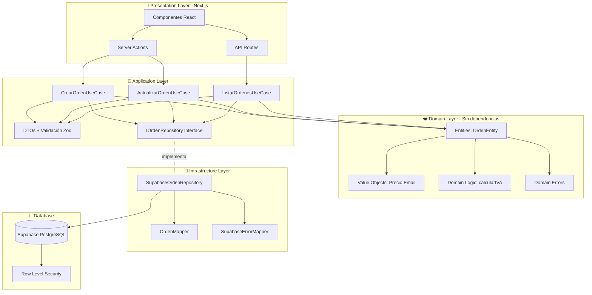
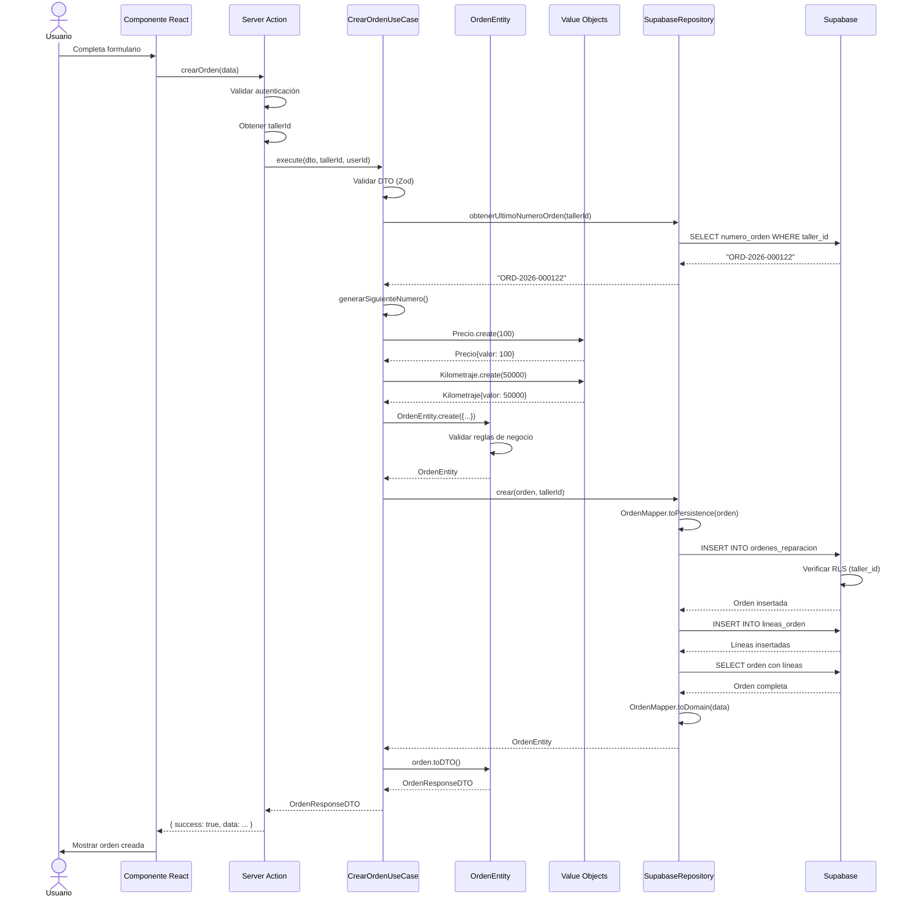
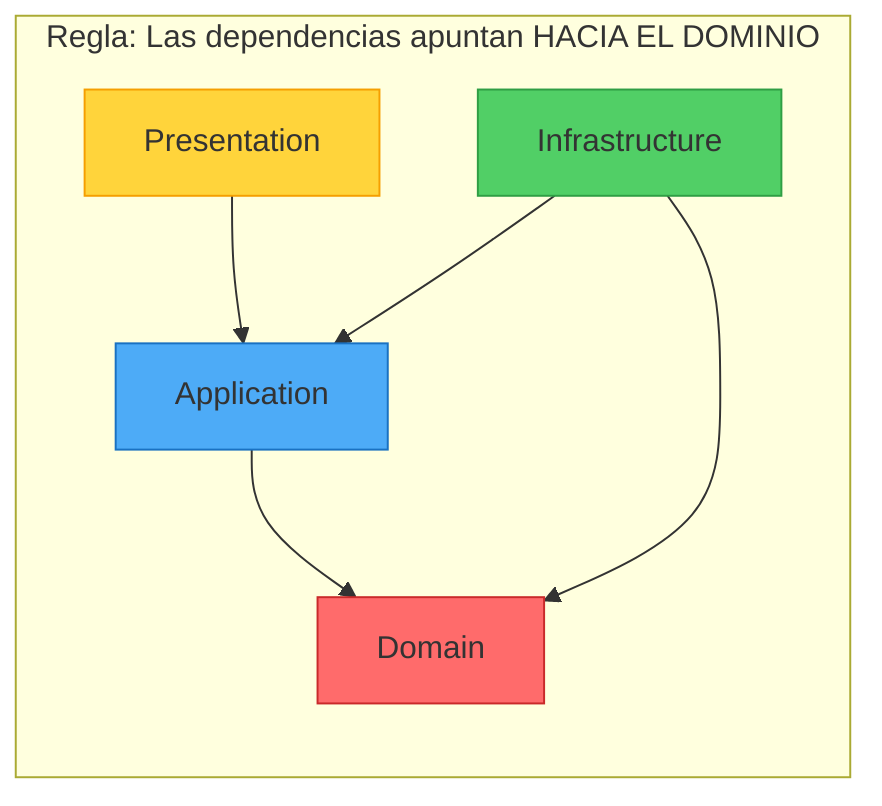
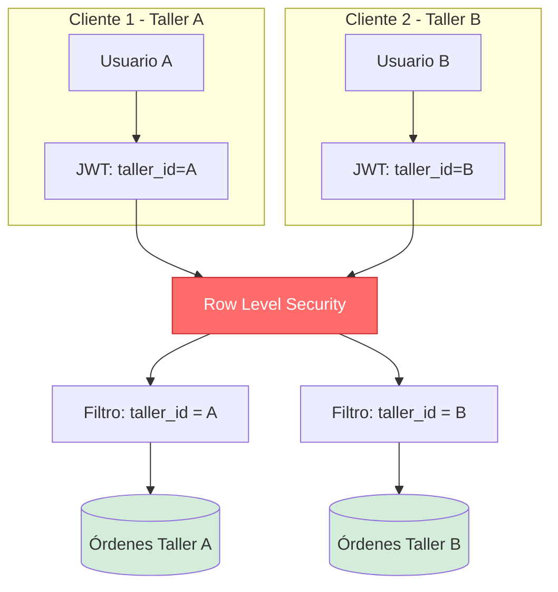
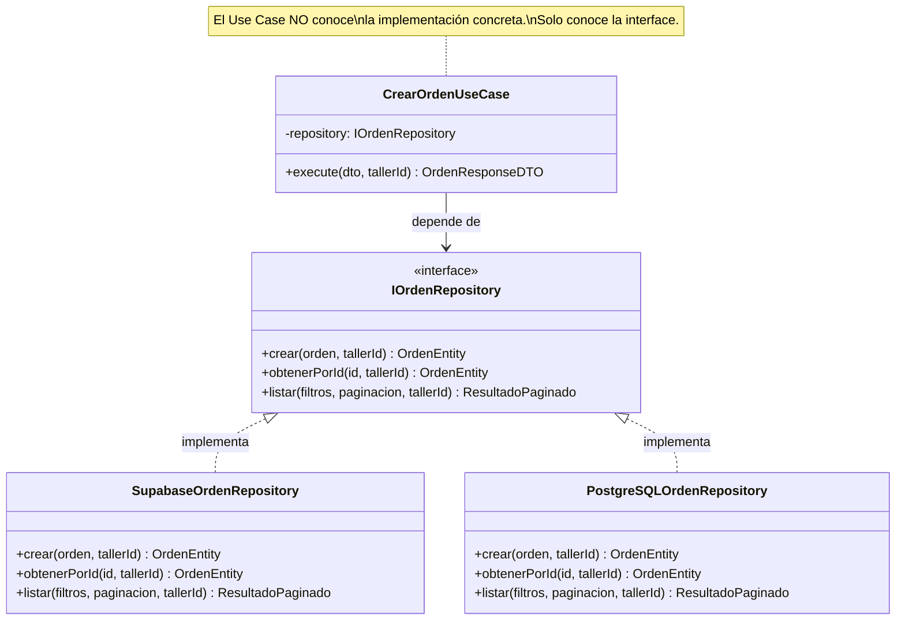
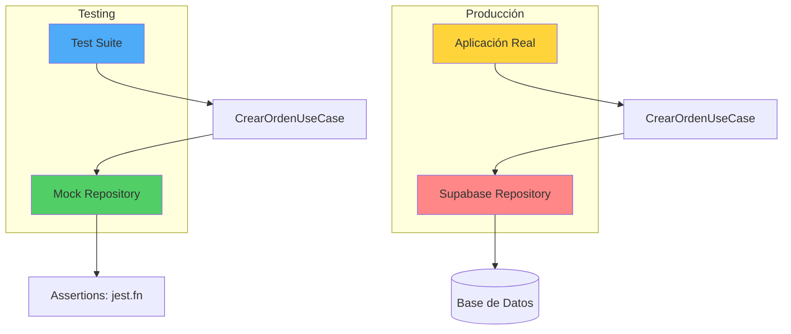
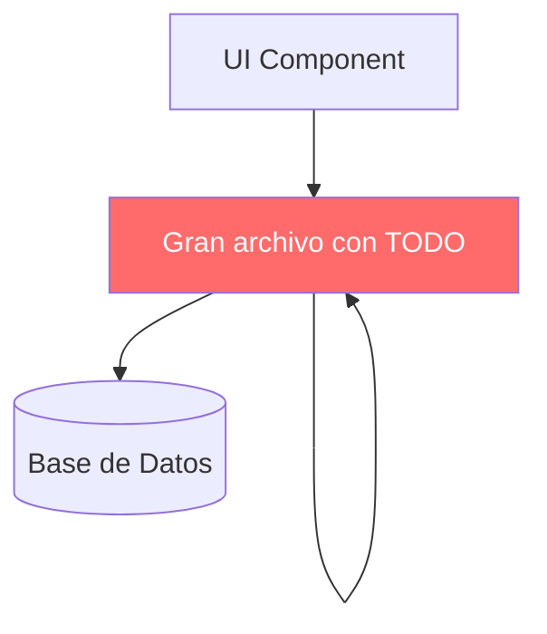
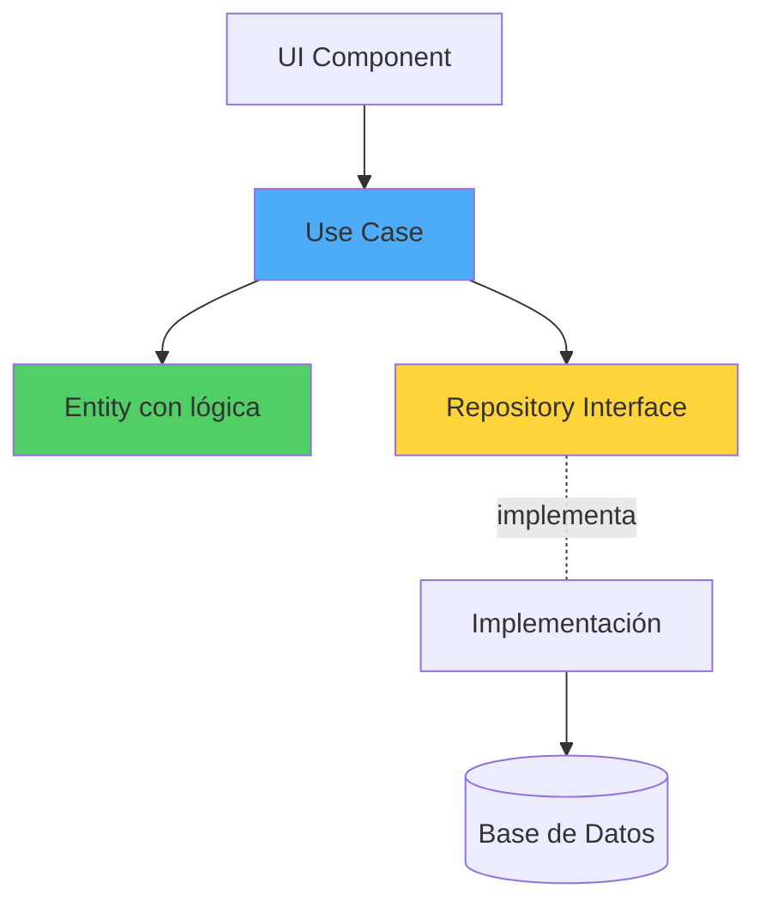

# 🎨 Diagrama de Arquitectura Clean - Módulo de Órdenes

## 📊 **Visión General de Capas**



---

## 🔄 **Flujo de Creación de Orden**



---

## 🧩 **Dependencias entre Capas**



**Explicación:**
- **Domain** no depende de nadie (capa más interna)
- **Application** depende solo de Domain
- **Infrastructure** implementa las interfaces de Application
- **Presentation** usa Application (no conoce Infrastructure directamente)

---

## 🔒 **Seguridad Multi-Tenant**



**Garantías:**
1. ✅ Usuario A NUNCA puede ver órdenes de Taller B
2. ✅ Filtro aplicado en BD (no solo en código)
3. ✅ Incluso si hackean el cliente, RLS protege

---

## 💡 **Value Objects - Validación en la Fuente**

```mermaid
graph TB
    INPUT[Input del usuario: -10 €]
    INPUT --> VO[Precio.create -10]
    VO --> VALID{¿Es válido?}
    VALID -->|No| ERR[❌ ValidationError]
    VALID -->|Sí| OK[✅ Precio{valor: 10}]

    INPUT2[Input del usuario: 100 €]
    INPUT2 --> VO2[Precio.create 100]
    VO2 --> VALID2{¿Es válido?}
    VALID2 -->|Sí| OK2[✅ Precio{valor: 100}]
    OK2 --> OPS[Operaciones: format, multiply, calcularIVA]

    style ERR fill:#ff6b6b
    style OK fill:#51cf66
    style OK2 fill:#51cf66
    style VO fill:#4dabf7
```

**Ventaja:** Si un precio llega a la entity, SIEMPRE es válido.

---

## 📦 **Repository Pattern - Inversión de Dependencias**



**Ventaja:** Cambiar de Supabase a PostgreSQL directo = cambiar 1 clase, no 100.

---

## 🧪 **Testing - Fácil con Inyección de Dependencias**



**Ventaja:** No necesitas BD real para testear lógica de negocio.

---

## 🎯 **Ejemplo de Flujo Completo**

```mermaid
graph TD
    A[Usuario: "Quiero crear orden"] --> B[UI: Formulario]
    B --> C[Server Action: crearOrden]
    C --> D{¿Usuario autenticado?}
    D -->|No| E[❌ Error 401]
    D -->|Sí| F[Obtener tallerId del JWT]
    F --> G[Use Case: CrearOrdenUseCase]
    G --> H{¿DTO válido Zod?}
    H -->|No| I[❌ ValidationError 400]
    H -->|Sí| J[Crear Value Objects]
    J --> K[Crear OrdenEntity]
    K --> L{¿Reglas de negocio OK?}
    L -->|No| M[❌ BusinessRuleError 422]
    L -->|Sí| N[Repository: crear]
    N --> O{¿RLS permite?}
    O -->|No| P[❌ ForbiddenError 403]
    O -->|Sí| Q[INSERT en BD]
    Q --> R[Mapear a DTO]
    R --> S[✅ Retornar OrdenResponseDTO]
    S --> T[UI: Mostrar orden creada]

    style E fill:#ff6b6b
    style I fill:#ff6b6b
    style M fill:#ff6b6b
    style P fill:#ff6b6b
    style S fill:#51cf66
    style T fill:#51cf66
```

---

## 📚 **Comparación: Antes vs Después**

### **Antes (Monolito):**



**Problemas:**
- 🔴 Lógica de negocio mezclada con BD
- 🔴 Difícil de testear
- 🔴 Cambiar BD = reescribir todo
- 🔴 Sin validación consistente

---

### **Después (Clean Architecture):**



**Ventajas:**
- ✅ Lógica de negocio separada
- ✅ Fácil de testear (mocks)
- ✅ Cambiar BD = cambiar 1 archivo
- ✅ Validación en Value Objects

---

## 🎓 **Conclusión**

Esta arquitectura garantiza:

1. **Mantenibilidad**: Cada capa tiene una responsabilidad única
2. **Testabilidad**: Inyección de dependencias en todos los niveles
3. **Escalabilidad**: Agregar nuevos casos de uso no rompe lo existente
4. **Seguridad**: Multi-tenancy en todas las capas (código + RLS)
5. **Claridad**: El código se explica solo (Domain Language)

**Recuerda:** Las dependencias siempre apuntan HACIA el dominio, nunca al revés.
